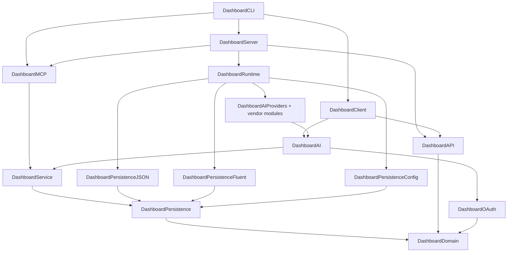
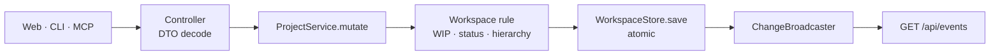

# Backend Architecture

_Backend only. The web app is documented in [`web/docs/`](../web/docs/) and [`website/docs/web/architecture.md`](../website/docs/web/architecture.md)._

Scope: [`PRD.md`](PRD.md). Rationale: [`DESIGN.md`](DESIGN.md). Traps: [`MEMORY.md`](MEMORY.md).

## One package, one target per layer

The repository root is one Swift package (`mvp-dashboard-backend`, tools 6.1, language mode
`.v6`, `.macOS(.v15)`), shipping the `dashboard` executable and the `DashboardServer` library.
Dependencies point inward: a target imports targets below it, never above.

| Target                       | Owns                                                                                               | Must not own                |
| ---------------------------- | -------------------------------------------------------------------------------------------------- | --------------------------- |
| `DashboardDomain`            | `Workspace` and its rules, `Project`, `Settings`, `AIConfig`, `TicketDraft`, `DomainError`         | any I/O or framework        |
| `DashboardPersistence`       | store protocols, in-memory stores, `StoreContract`, `AtomicFile`, `RFC3339`                        | a concrete format or engine |
| `DashboardPersistenceJSON`   | `kanban.json` (kanban-rs v18), JSON registry, settings, credentials                                | domain rules                |
| `DashboardPersistenceFluent` | the same stores on SQLite, `SQLiteDatabase` and its pool                                           | domain rules                |
| `DashboardPersistenceConfig` | `config.yaml` / `config.json` via swift-configuration (file + env)                                 | secrets                     |
| `DashboardService`           | the service actors, the command protocols, `ChangeEvent` / `ChangeBroadcaster`, `@Dependency` keys | transport, serialisation    |
| `DashboardAI`                | `AIProvider`, `AssistantService`, `PromptBuilder`, `AIProviderRegistry`, `FakeProvider`            | a vendor SDK                |
| `DashboardAIProviders`       | `AnyLanguageModelProvider`, `ClaudeCodeProvider`                                                   | prompts, validation         |
| `DashboardProvider*`         | one vendor each: its factory and its `ProviderSignIn`                                              | another vendor              |
| `DashboardOAuth`             | PKCE, `OAuthCodeFlow`, `SignInSessions`, `HTTPTransport`                                           | vendor URLs                 |
| `DashboardAPI`               | wire DTOs, `Page`, `ApiError`, SSE frames                                                          | business logic              |
| `DashboardClient`            | `Remote*Commands` — the command protocols over HTTP                                                | local file access           |
| `DashboardMCP`               | `KanbanTools` and `KanbanToolDispatcher`                                                           | storage, transport          |
| `DashboardRuntime`           | `ServiceKey`s, `register`/`shutdown`, `RuntimeConfig`, `WorkspaceStores`                           | request handling            |
| `DashboardServer`            | Vapor routes, `ApiErrorMiddleware`, `DynamicCORSMiddleware`, events socket, `/mcp`                 | domain rules, storage       |
| `DashboardCLI`               | argument parsing, one container per invocation, JSON output                                        | anything reusable           |

Each target has a matching test target; the vendor modules share `DashboardProviderTests`.

## Command protocols

`DashboardService` declares what a client can do (`ProjectCommands`, `BoardCommands`,
`SettingsCommands`, `AIConfigCommands`, `SignInCommands`, plus `AssistantCommands` in
`DashboardAI`) and ships the `Local*` implementations; `DashboardClient` ships the `Remote*`
ones over HTTP. Call sites depend on the protocol, so the same code runs with or without a
server — the binding happens at composition time.

## Composition and DI

`DashboardRuntime.register` is the only place that picks concrete stores, databases and
providers; `shutdown` tears them down in reverse through `ShutdownHooks`. Services are
registered under typed `ServiceKey`s.

- **CLI** — one container per invocation, built from `RuntimeConfig`; the home is resolved
  from the environment or the working directory, never from a flag.
- **Server** — one container on the Vapor app, plus a per-request container for request-scoped
  values (the request id echoed as `X-Request-Id`), falling through to the app container.

cascade-kit plays two roles: the **container** for anything with a lifetime, `@Dependency` for
ambient values (`\.now`, `\.uuid`, `\.home`, `\.logger`). A service reads the clock or an id
through `@Dependency`, never `Date()` or `UUID()` — that is what makes tests deterministic.

## Storage

`Workspace` is the only model. `KanbanJSONStore` writes the kanban-rs v18 envelope and
preserves unknown sections; `FluentWorkspaceStore` writes SQLite with one `SQLiteDatabase` per
project file. `WorkspaceStores.factory` is the single `StorageKind` → store mapping; nothing
else branches on it, so a storage switch is load-then-save.

Both stores pass `StoreContract`; `DashboardPersistenceFluentTests` proves the JSON → SQLite →
JSON round trip. On-disk contract: [`PRD.md`](PRD.md#data-contract).

## The write path

`ProjectService.mutate` loads the workspace, applies the domain operation, saves, publishes a
`ChangeEvent` — `projectsChanged`, `workspaceChanged(projectId:)`, `settingsChanged`,
`aiConfigChanged`. The socket carries no data, so a lost event costs one refetch; slow
subscribers drop the oldest events rather than block a publisher.

## Errors

`DomainError`, `ServiceError` and `PersistenceError` travel up untouched; `ApiErrorMiddleware`
maps them once to `{code, message}` with a status and `X-Request-Id`. Codes:
`VALIDATION_FAILED`, `NOT_FOUND`, `ALREADY_EXISTS`, `AI_NOT_CONFIGURED`, `AI_PROVIDER`,
`AI_BAD_OUTPUT`, `INTERNAL`. A controller never builds an envelope by hand.

## CLI routing

There is one route: the home's daemon, found through `daemon.port` and started when nothing
answers. Commands bind `Remote*Commands` against it and never open a store, so `Mode`,
`--local`, `--remote` and `--server` are all gone. The home is resolved from the environment or
the working directory ([`HomeKey`](../Sources/DashboardService/Dependencies.swift)), not a flag.
JSON on stdout, narration on stderr.

## MCP

`KanbanTools` is the catalogue, `KanbanToolDispatcher` maps a call onto the command protocols.
Knowing nothing about storage or transport, the same dispatcher serves both cases:
`dashboard mcp` through the home's daemon, and `POST /mcp` inside the server. Arguments
accept names or ids; domain failures come back as tool errors.

## AI pipeline

`AIProvider` is one streaming contract (`CompletionRequest` in, `CompletionEvent`s out,
`CompletionResult` at the end). `AnyLanguageModelProvider` covers the API vendors,
`ClaudeCodeProvider` the headless `claude -p` process; `AIProviderRegistry` maps a kind to a
factory.

`AssistantService.streamTicket` owns everything above the provider: resolve, build board
context, build the prompt, stream, complete half-typed JSON into a partial draft, validate into
a `TicketDraft`, price the usage. Its `AssistantEvent`s become SSE frames for HTTP and stderr
lines for the CLI.

Sign-in is `DashboardOAuth` plus one module per vendor; the callback lands on
`/api/auth/callback` and the credential goes to `credentials.json`.

## Boundary with the web app

The contract is the `/api` REST surface, the SSE draft stream and the `/api/events` socket.
How the browser consumes them is out of scope — see [`web/docs/`](../web/docs/).

## Build, test, run

| Command                       | What                                              |
| ----------------------------- | ------------------------------------------------- |
| `mise run backend:build`      | `swift build`                                     |
| `mise run backend:test`       | `swift test`                                      |
| `mise run backend:serve`      | `dashboard serve` on the configured host and port |
| `mise run backend:release`    | release binary in `.build/release/dashboard`      |
| `mise run cli -- <args>`      | the CLI from source                               |
| `mise run backend:test:linux` | the tests in the `swift:6.3.3-noble` container    |
| `mise run check`              | everything CI runs                                |

CI runs the package on `ubuntu-24.04` (container) and `macos-26` with the pinned toolchain.
