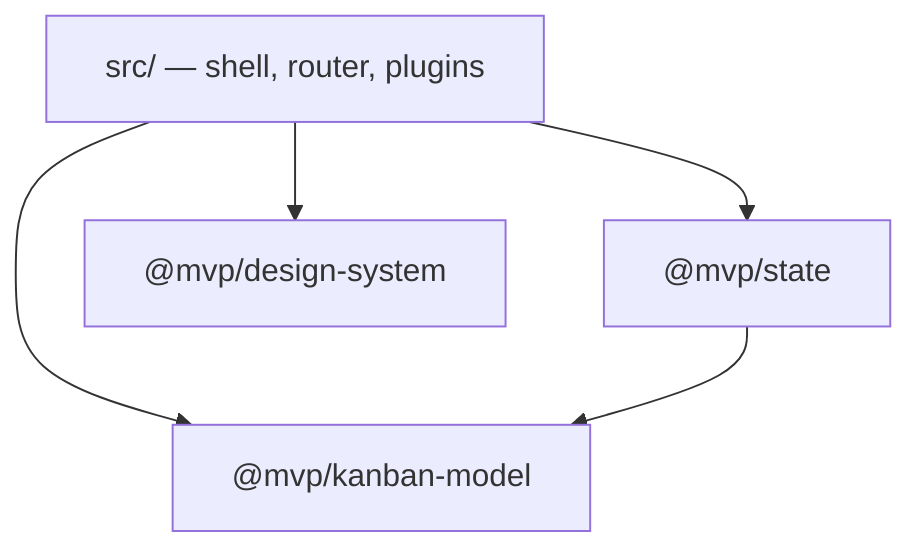
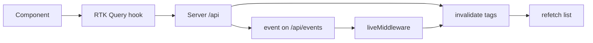

# Web App Architecture

_Frontend only. The server is documented in [`docs/ARCHITECTURE.md`](../../docs/ARCHITECTURE.md)._

## Packages

A pnpm workspace: three libraries and one app. Imports point one way only, enforced by
`no-restricted-imports` blocks in [`eslint.config.js`](../eslint.config.js).

| Package              | Contains                                                                          | Must not import             |
| -------------------- | --------------------------------------------------------------------------------- | --------------------------- |
| `@mvp/kanban-model`  | wire types, board grouping, hierarchy index, colours, checklist and draft helpers | React, Redux, any package   |
| `@mvp/design-system` | components over purple3 (`Button`, `Modal`, `Markdown`, …), `cx`, icons           | Redux, the store, the model |
| `@mvp/state`         | the store, RTK Query endpoints, settings, the live socket, the AI stream          | React, the design system    |
| `src/` (app)         | shell, router, plugins, dialogs, the board                                        | package internals by path   |

The app imports a package by name (`@mvp/state`), never by file; `@/` aliases `src/`
([`vite.config.ts`](../vite.config.ts), [`tsconfig.app.json`](../tsconfig.app.json)). Each
package has its own `tsconfig.json` so it type-checks alone.

## Composition root

[`src/main.tsx`](../src/main.tsx) mounts [`src/app/App.tsx`](../src/app/App.tsx), which creates
the store, builds the router from the plugin registry and dispatches `startLive()` on mount,
`stopLive()` on unmount. [`src/app/plugins.ts`](../src/app/plugins.ts) is the plugin list —
the only file that changes when an app area is added.

## Plugins

A `DashboardPlugin` ([`src/core/plugin/types.ts`](../src/core/plugin/types.ts)) is `id`, `name`,
`nav: NavItem[]`, `routes: RouteObject[]` and an optional `sidebar` component.
`buildRegistry` ([`registry.ts`](../src/core/plugin/registry.ts)) rejects duplicate ids and
flattens the three lists for the shell and the router. Three plugins today: `overview`,
`projects`, `settings`.

`AppShell` renders the nav, the sidebar sections, `ServerStatus` and the theme picker
([`src/core/shell/`](../src/core/shell/), [`src/core/settings/`](../src/core/settings/)).

## Store

`createStore()` ([`packages/state/src/store.ts`](../packages/state/src/store.ts)) combines five
slices — `shell`, `settings`, `live`, `assistant` and the `baseApi` reducer — and adds the
API middleware plus `liveMiddleware`. A subscription persists the settings slice to
`localStorage` whenever it changes.

`baseApi` ([`api/baseApi.ts`](../packages/state/src/api/baseApi.ts)) is one RTK Query API with
no endpoints of its own: each file under `api/` injects its own (`projectsApi`, `kanbanApi`,
`settingsApi`, `aiConfigApi`, `healthApi`). Its base query is resolved per request from
`settings.serverUrl`, so changing the server in settings applies immediately without a reload.
Tags: `Project`, `Board`, `Column`, `Card`, `Settings`, `AIConfig`.

Mutations do not update the cache optimistically: they invalidate tags and the affected list
refetches. `errorMessage(error)` unwraps the server's `{code, message}` envelope.

## A mutation, end to end

The same invalidation happens twice — once locally from the mutation, once from the change
event that every other open tab receives. Refetching is idempotent, so this costs one request
and keeps every tab correct.

## Live socket

`liveMiddleware` ([`live/liveMiddleware.ts`](../packages/state/src/live/liveMiddleware.ts))
owns the single WebSocket. It connects on `startLive`, reconnects with a 1s → 30s doubling
backoff on close, and reconnects immediately when the server URL changes.

`events.ts` parses a frame and maps it to tags: `projects_changed` → `Project`,
`settings_changed` → `Settings`, `ai_config_changed` → `AIConfig`, `workspace_changed` →
`Board`, `Column`, `Card`; `hello` invalidates nothing. Frames are snake_case on the wire, and
an unknown kind is ignored. `liveSlice` holds the status the shell displays.

## AI drafting

`assistantSlice` ([`assistant/`](../packages/state/src/assistant/)) runs the draft as a thunk
over an SSE stream (`sse.ts` → `readEventStream`) and reduces the frames `stage`, `text`,
`partial`, `usage`, `result`, `error` into one state: current step, elapsed time, the stage
log, the partial draft, usage, the result, plus a per-session cost total.

The UI reads only that state: `DraftWithAI` fills the card form from `partial`,
`ActivityPanel` renders the log and the details, `assistantLog.ts` and `tracker.ts` are pure
modules next to them. Nothing is created until the user submits the form.

## Pure modules next to components

The pattern throughout: the decision lives in a `.ts`, the `.tsx` next to it only renders.
`buildBoardIndex` (hierarchy, colours, progress) in the model package; `cardForm.ts` (a pure
reducer for the card dialog); `dragAndDrop.ts` (the drag payload and its parser);
`origins.ts`, `tracker.ts`, `assistantLog.ts`. They are tested with plain data, no rendering.

Where new code goes: does it need React or the DOM? No → `kanban-model` if it is about board
data, `state` if it is about fetching or remembering. Yes, and it is reusable and knows nothing
about kanban → `design-system`. Otherwise → the plugin.

## Dev and build

Vite serves on 5173 and proxies `/api` to `http://127.0.0.1:5175` with `ws: true`, so HTTP and
the socket share an origin in development. The production build injects a CSP meta tag
(`cspPlugin` in [`vite.config.ts`](../vite.config.ts)) and is served by the backend process.

| Command              | What                                    |
| -------------------- | --------------------------------------- |
| `pnpm dev`           | Vite dev server                         |
| `pnpm build`         | `tsc -b` then `vite build` into `dist/` |
| `pnpm typecheck`     | `tsc -b` across the workspace           |
| `pnpm lint`          | ESLint, including the layering rules    |
| `pnpm test`          | Vitest (jsdom)                          |
| `pnpm test:coverage` | what CI runs                            |

## Tests

28 test files under `src/**` and `packages/*/src/**`. UI tests stub the server with
`stubApi()` from `@mvp/state/testing`: handlers keyed by `METHOD /api/path`, which also answer
SSE frames for the draft stream. Pure modules are tested with plain objects — no store, no
rendering.
