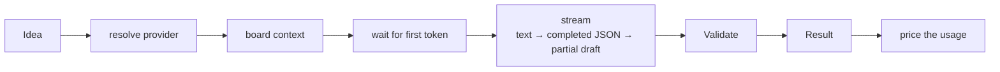

# Streaming and cost

## The pipeline



`AssistantService.streamTicket` emits **events** as it goes; every client renders the same
stream:

| Event     | Content                                                                                   |
| --------- | ----------------------------------------------------------------------------------------- |
| `stage`   | `step` (resolve · context · wait · stream · validate · done), optional detail, elapsed ms |
| `text`    | raw model output as typed                                                                 |
| `partial` | the draft so far — fields may be missing, never invented                                  |
| `usage`   | tokens and cost                                                                           |
| `result`  | the validated draft with provider, model and usage                                        |

Over HTTP these are server-sent events (`Accept: text/event-stream`); the CLI's `--stream`
narrates them; the web's activity panel renders them.

### Partial drafts without lying

Models type JSON one token at a time. `JSONCompleter` closes whatever is open (strings,
arrays, objects) and **drops** a trailing token that cannot be finished — a half-typed key, a
half-typed number, a half-typed enum — so a partial draft only ever contains values the
model actually produced. "priority: hi" is dropped, not guessed as high. The test suite cuts a
full draft at every character offset and checks that no prefix invents a value.

Claude Code sometimes wraps its structured output as an escaped string under a placeholder
key; the provider unwraps it so partials keep flowing.

## Validation

The final JSON becomes a `TicketDraft` only if it passes: non-empty title ≤ 200 characters,
a known priority, points in 0–255, at most 12 criteria and 8 sub-tasks, each sub-task with a
title. Otherwise the draft is rejected with `AI_BAD_OUTPUT` — you see the raw output in the
panel and can retry.

## Cost

Three sources, in order:

1. **Reported by the vendor** — Claude Code returns its exact `total_cost_usd`. Used as is.
2. **Computed from pricing** — when the provider has `pricing` (USD per million input/output
   tokens), `tokens × price`, flagged `estimated` (shown as `≈ $0.03`).
3. **Free** — `apple` and `ollama` run locally: `$0.00`.

Without pricing and without a vendor figure the cost stays **unknown** (`—`), never guessed.

### On the card

A card created from a draft carries `ai_cost`:

```json
{
  "provider": "cc",
  "model": "sonnet",
  "input_tokens": 2,
  "output_tokens": 418,
  "cost_usd": 0.028,
  "estimated": false
}
```

It shows on the board (`✨ $0.03`) and in the card dialog. Sub-tasks created with the draft
carry no cost of their own — the draft was one request — so a project total is a plain sum
over cards. This is the first entry of a card's cost history; tracking the cost of a card
from backlog to done, and project totals, build on it.

### In the session

The activity panel keeps a running total for the browser session ("this session: 4 drafts,
$0.11") so a drafting spree is never a surprise.
