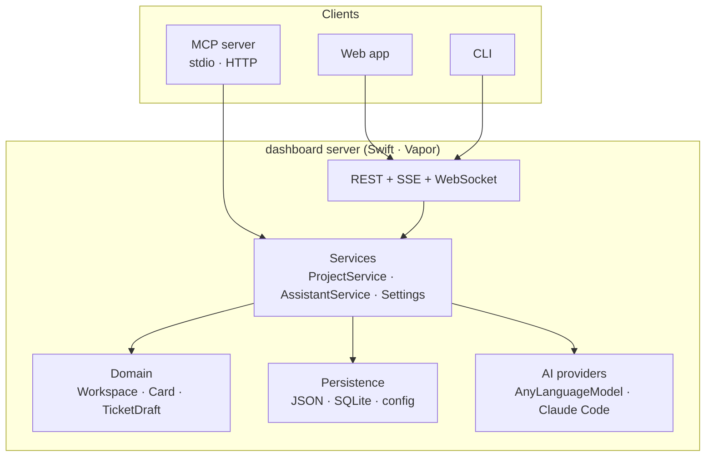

# Architecture

Three principles shape everything:

1. **The server is the single source of truth.** Every client — web, CLI, MCP — talks to the
   running server over the same HTTP API. The server writes the files, emits one change
   event per mutation, and every open browser refetches. The CLI only touches files directly
   when no server is running (`--local`).
2. **Clean architecture, dependencies pointing inward.** Domain → persistence → services →
   interfaces. The kanban `Workspace` aggregate knows nothing about JSON, SQLite, Vapor or AI.
3. **Files you own, in formats that outlive this tool.** `kanban.json` is the kanban-rs v18
   format; `config.yaml`, `settings.json` and the coming agent files are plain text.



## Backend targets

One Swift package, one target per layer. A target may only import targets below it.

| Target                       | Role                                                                                                                                                                                    |
| ---------------------------- | --------------------------------------------------------------------------------------------------------------------------------------------------------------------------------------- |
| `DashboardDomain`            | `Project`, `Settings`, `AIConfig`, `TicketDraft`, and the kanban `Workspace` aggregate: boards, columns, cards, parent/child links, numbering, WIP, status rules. Pure Swift, no I/O.   |
| `DashboardPersistence`       | Store protocols (`ProjectStore`, `WorkspaceStore`, `SettingsStore`, `AIConfigStore`), in-memory stores, the **contract tests** every store must pass, RFC 3339 codec.                   |
| `DashboardPersistenceJSON`   | `kanban.json` (kanban-rs v18 envelope), the project registry and settings files; atomic writes.                                                                                         |
| `DashboardPersistenceFluent` | The same stores on SQLite through Fluent; a database pool per project file.                                                                                                             |
| `DashboardPersistenceConfig` | `config.yaml` / `config.json` for AI providers, read with swift-configuration (file + environment).                                                                                     |
| `DashboardService`           | `ProjectService`, `SettingsService`, `AIConfigService` actors; the **command protocols** every client speaks (`ProjectCommands`, `BoardCommands`, `AssistantCommands`…); change events. |
| `DashboardAI`                | The `AIProvider` streaming contract, `AssistantService` (board context → prompt → partial drafts → validated draft), prompt builder, partial-JSON completer.                            |
| `DashboardAIProviders`       | `AnyLanguageModelProvider` (apple, anthropic, openai, gemini, ollama) and `ClaudeCodeProvider`.                                                                                         |
| `DashboardAPI`               | Wire DTOs: request/response shapes, `Page`, `ApiError`, the SSE frames of a draft.                                                                                                      |
| `DashboardServer`            | The Vapor app: routes, error envelope with `X-Request-Id`, CORS from live settings, the events socket, the MCP HTTP endpoint.                                                           |
| `DashboardClient`            | The command protocols implemented over HTTP — what the CLI and MCP use when a server is running.                                                                                        |
| `DashboardMCP`               | The MCP tool catalogue and dispatcher over the command protocols.                                                                                                                       |
| `DashboardRuntime`           | Composition root shared by server and CLI: the cascade-kit container, service keys, shutdown hooks.                                                                                     |
| `DashboardCLI`               | The `dashboard` executable.                                                                                                                                                             |

### Interchangeable storage

`Workspace` is the only model. `KanbanJSONStore` and `FluentWorkspaceStore` both implement
`WorkspaceStore` and both pass the same contract tests, so a project can switch storage
(`PATCH /projects/{id} {storage}`) by loading from one and saving to the other. Anything
kanban-rs stores that this dashboard does not model (sprints, archives, other graph kinds)
rides along untouched in the workspace's `extra` section.

### Dependency injection

[cascade-kit](https://github.com/amine2233/cascade-kit) in two roles: a **container** for
services with explicit lifetimes and async shutdown (`DashboardRuntime.register`), and
`@Dependency` for ambient values (`now`, `uuid`, `home`, `logger`) that tests override with
`withDependencies`. The server adds a per-request container so request-scoped values (the
request id) follow the app → request hierarchy.

### One flow, end to end

"Move a card" from the CLI:

1. `dashboard project …` detects a running server (`/api/health`) and uses
   `RemoteBoardCommands` (`DashboardClient`) → `PATCH …/cards/{id} {column_id}`.
2. `KanbanController` decodes the DTO and calls `ProjectService.mutate`, which loads the
   workspace, applies `Workspace.moveCard` (WIP check, status rule), saves through the
   project's store, and broadcasts `board_changed`.
3. Every browser's `liveMiddleware` receives the event over `/api/events` and invalidates the
   `Card` cache tag; RTK Query refetches; the board re-renders.

## Front end

The web app is a pnpm workspace with three library packages and one application; see
[Web architecture](web/architecture).

## Repository layout

```
backend/            Swift package (targets above) and its tests
src/                web app: shell, router, plugins
packages/           @mvp/kanban-model · @mvp/state · @mvp/design-system
website/            this documentation (Docusaurus)
docs/               design notes: conceptions, front-end architecture
mise.toml           toolchain and tasks
```
