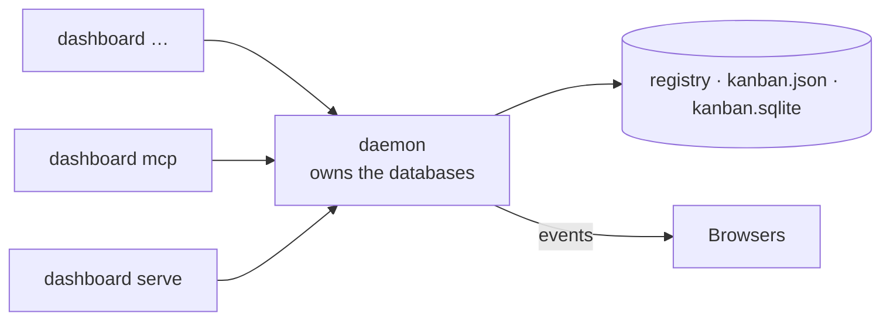

# CLI

`dashboard` is the same binary as the server. During development run it with
`mise run cli -- <args>`; after `mise run backend:release` it is
`./.build/release/dashboard` at the repository root.

All output is **JSON on stdout**, so it composes with `jq` and scripts. Errors go to stderr
as `{"error": {"message": …}}` with exit code 1. Progress narration (`--stream`, `--verbose`)
also goes to stderr, never mixing with the JSON.

## Where a command goes

Every command talks to the **daemon**: the one process that opens this home's databases.
Nothing else touches them, which is what keeps two writers off one SQLite file.



The first command that finds no daemon starts one and waits for it. It then stays up, so the
next command is immediate and a change made through MCP is seen by an open browser. It runs
until you stop it — see [Daemon](#daemon).

There is no flag to point a command somewhere else. `dashboard serve` owns its home like the
daemon does, so starting a server and then running a command already routes through it —
nothing to configure, and no way to work on the files behind a running owner's back, which is
what used to corrupt them.

## Home

The home holds everything global — the registry, providers, credentials and the daemon handle.
There is no `--home` flag: the directory you run from already says which one you meant.

| Order | Home                                                               | When                             |
| ----- | ------------------------------------------------------------------ | -------------------------------- |
| 1     | `$MVP_DASHBOARD_HOME`                                              | set explicitly                   |
| 2     | `./.kanban-harness/`                                               | that folder exists where you ran |
| 3     | `$XDG_CONFIG_HOME/kanban-harness`, else `~/.config/kanban-harness` | otherwise                        |

```text
~/.config/kanban-harness/
├── config.yml        # AI providers and settings (config.yaml / config.json also read)
├── credentials.json  # API keys and OAuth tokens — never in config.yml
├── projects.sqlite   # the registry of projects
└── daemon.port       # the running daemon's port and pid
```

To give a repository its own projects, providers and daemon, create `.kanban-harness/` in it:

```bash
mkdir .kanban-harness
dashboard project add .          # registered in this folder's home, not yours
```

Each home gets its own daemon on its own port, so the two never interfere.

:::note
The daemon does the work, and it inherits the environment of whichever command started it.
`MVP_DASHBOARD_CLAUDE_BIN=… dashboard ai ticket …` has no effect if a daemon is already
running — put the value in `config.yml`, which is read per request, or stop the daemon first.
:::

## Daemon

```bash
dashboard daemon status            # is one running for this home, and where
dashboard daemon start             # start it if it is not already up
dashboard daemon stop              # stop it; the next command starts a new one
dashboard daemon run               # run it in the foreground (what start spawns)
```

You rarely need `start` — any command does it. See [Daemon](daemon) for the lifecycle, the
handover with `dashboard serve`, and what to do when something is wrong.

## Projects

```bash
dashboard project add ~/work/demo [--name Demo] [--storage json|sqlite]
dashboard project list
dashboard project show    <name|id>
dashboard project boards  <name|id>
dashboard project storage <name|id> json|sqlite     # convert in place, the old file is kept
dashboard project remove  <name|id>                 # unregister only; nothing is deleted
```

## Settings

```bash
dashboard settings show
dashboard settings set [--default-storage sqlite] [--cors-origin URL ...] [--clear-cors]
```

## AI

```bash
dashboard ai providers list
dashboard ai providers add <id> --kind K --model M [--name N] [--base-url URL] [--api-key KEY] \
                               [--max-tokens N] [--input-price USD --output-price USD]
                               [--oauth-client-id ID [--oauth-client-secret S]]
dashboard ai providers remove <id>
dashboard ai providers default <id>
dashboard ai providers login <id> [--no-open] [--timeout S]   # browser sign-in (openrouter, huggingface)
dashboard ai providers logout <id>

dashboard ai ticket <project> "idea" [--board B] [--provider P] [--stream] [--create [--column C]]
```

`ai ticket` prints the draft (`{draft, provider, model, usage}`); `--create` turns it into a
card **and its sub-tasks** in one step and prints `{draft, card_id, key}`; `--stream` narrates
on stderr while stdout stays JSON:

```text
[     0ms] resolve
[     0ms] resolve: Claude Code (sonnet)
[     2ms] context: 4 columns, 12 cards, ~1.2k tokens
[     2ms] wait
[  2262ms] stream
          title: Add password reset flow to mobile app
          tokens: 2 in / 418 out, $0.0282
[  6163ms] validate
[  6163ms] done
```

Keys are never printed by `providers list`; prefer `MVP_DASHBOARD_AI_PROVIDERS_<ID>_API_KEY`
over `--api-key` to keep them out of the file.

## Server and MCP

```bash
dashboard serve [--hostname 127.0.0.1] [--port 5175] [--static-dir dist] [--cors-origin URL ...] \
                [--public-url http://127.0.0.1:5173]
dashboard mcp                     # MCP server over stdio — see MCP
dashboard --verbose …             # info-level logs on stderr
                                  # migrations are the daemon's: dashboard --verbose daemon run
```

## Examples

```bash
# a project, a card, live in the browser
dashboard project add ~/work/app --name App
dashboard ai ticket App "users cannot reset their password from the mobile app" --create --column "To do"

# every card of the first board, as a table
dashboard project boards App | jq -r '.[0].id' \
  | xargs -I{} curl -s "http://127.0.0.1:5175/api/projects/$(dashboard project show App | jq -r .id)/kanban/v1/boards/{}/cards" \
  | jq -r '.items[] | "\(.prefix)-\(.card_number)\t\(.status)\t\(.title)"'
```
