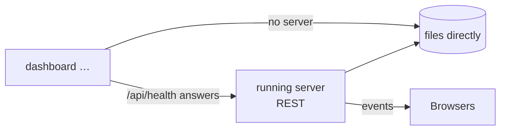

# CLI

`dashboard` is the same binary as the server. During development run it with
`mise run cli -- <args>`; after `mise run backend:release` it is
`./.build/release/dashboard` at the repository root.

All output is **JSON on stdout**, so it composes with `jq` and scripts. Errors go to stderr
as `{"error": {"message": …}}` with exit code 1. Progress narration (`--stream`, `--verbose`)
also goes to stderr, never mixing with the JSON.

## Where a command goes



If a dashboard server answers (`--server URL`, else `$MVP_DASHBOARD_URL`, else
`http://127.0.0.1:$MVP_DASHBOARD_PORT`), the CLI talks to it over the HTTP API — the server
stays the single writer and every open browser sees the change. With no server it works on
the files directly. `--remote` fails instead of falling back; `--local` forces the files even
when a server is up (useful for scripts that must not depend on one).

`--home <dir>` picks the registry/settings folder (or `MVP_DASHBOARD_HOME`), local mode only.

## Projects

```bash
dashboard project add ~/work/demo [--name Demo] [--storage json|sqlite]
dashboard project list
dashboard project show    <name|id>
dashboard project boards  <name|id>
dashboard project storage <name|id> json|sqlite     # convert in place, the old file is kept
dashboard project remove  <name|id>                 # unregister only; nothing is deleted
```

## Settings

```bash
dashboard settings show
dashboard settings set [--default-storage sqlite] [--cors-origin URL ...] [--clear-cors]
```

## AI

```bash
dashboard ai providers list
dashboard ai providers add <id> --kind K --model M [--name N] [--base-url URL] [--api-key KEY] \
                               [--max-tokens N] [--input-price USD --output-price USD]
                               [--oauth-client-id ID [--oauth-client-secret S]]
dashboard ai providers remove <id>
dashboard ai providers default <id>
dashboard ai providers login <id> [--no-open] [--timeout S]   # browser sign-in (openrouter, huggingface)
dashboard ai providers logout <id>

dashboard ai ticket <project> "idea" [--board B] [--provider P] [--stream] [--create [--column C]]
```

`ai ticket` prints the draft (`{draft, provider, model, usage}`); `--create` turns it into a
card **and its sub-tasks** in one step and prints `{draft, card_id, key}`; `--stream` narrates
on stderr while stdout stays JSON:

```text
[     0ms] resolve
[     0ms] resolve: Claude Code (sonnet)
[     2ms] context: 4 columns, 12 cards, ~1.2k tokens
[     2ms] wait
[  2262ms] stream
          title: Add password reset flow to mobile app
          tokens: 2 in / 418 out, $0.0282
[  6163ms] validate
[  6163ms] done
```

Keys are never printed by `providers list`; prefer `MVP_DASHBOARD_AI_PROVIDERS_<ID>_API_KEY`
over `--api-key` to keep them out of the file.

## Server and MCP

```bash
dashboard serve [--hostname 127.0.0.1] [--port 5175] [--static-dir dist] [--cors-origin URL ...]
dashboard mcp                     # MCP server over stdio — see MCP
dashboard --verbose …             # info-level logs (migrations, database activity) on stderr
```

## Examples

```bash
# a project, a card, live in the browser
dashboard project add ~/work/app --name App
dashboard ai ticket App "users cannot reset their password from the mobile app" --create --column "To do"

# every card of the first board, as a table
dashboard project boards App | jq -r '.[0].id' \
  | xargs -I{} curl -s "http://127.0.0.1:5175/api/projects/$(dashboard project show App | jq -r .id)/kanban/v1/boards/{}/cards" \
  | jq -r '.items[] | "\(.prefix)-\(.card_number)\t\(.status)\t\(.title)"'
```
