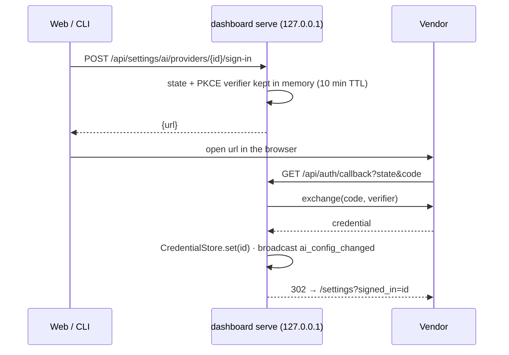

:::note Design note
Browser sign-in (OAuth / PKCE) for AI providers and where credentials are stored on macOS and Linux; OpenRouter first, Hugging Face after. Source: `docs/conceptions/provider-sign-in.md`.
:::

# Provider sign-in (OAuth / PKCE) and credential storage

How a provider gets a credential without the user pasting a key, where that credential
lives on macOS and Linux, and how a new vendor (OpenRouter first, Hugging Face after) plugs
in without touching the flow.

## Today

There is **no OAuth**. A provider has an optional static `api_key`:

- read from `config.yaml` (written `0600`, never returned by the API — only `has_api_key`),
- or from the environment `MVP_DASHBOARD_AI_PROVIDERS_<ID>_API_KEY`, which is never written
  back to the file (`ConfigFileAIConfigStore`).

Same behaviour on macOS and Linux. That stays valid: pasting a key remains the fallback
for every kind, and the only option for vendors without a sign-in flow.

## What the vendors offer

| Vendor                    | Sign-in                                                                                                                                                                                            | What you get                                 | Expires                         |
| ------------------------- | -------------------------------------------------------------------------------------------------------------------------------------------------------------------------------------------------- | -------------------------------------------- | ------------------------------- |
| OpenRouter                | PKCE: `https://openrouter.ai/auth?callback_url=…&code_challenge=…&code_challenge_method=S256`, then `POST https://openrouter.ai/api/v1/auth/keys {code, code_verifier, code_challenge_method}`     | an **API key** (`sk-or-…`) scoped to the app | never (revocable on their site) |
| Hugging Face              | OAuth 2 / OIDC with PKCE: `https://huggingface.co/oauth/authorize` → `https://huggingface.co/oauth/token`; needs an OAuth app registered on hf.co (client id, redirect URI); scope `inference-api` | an **access token** + refresh token          | yes (refresh)                   |
| OpenAI, Anthropic, Gemini | none for API use                                                                                                                                                                                   | paste a key                                  | —                               |

OpenRouter is the easy one — the exchange returns a plain key, so after sign-in it is
exactly a pasted key. Hugging Face needs refresh handling and an app registration, which is
why it comes second (a pasted `hf_…` user token works today).

## Design

### 1. One credential store, next to the config

Credentials move out of `config.yaml` into their own store so the config file can be
shared/committed and so the storage backend can differ per platform.

```swift
// DashboardPersistence
public struct Credential: Codable, Equatable, Sendable {
    public var secret: String               // API key or access token
    public var refreshToken: String?        // OAuth only
    public var expiresAt: Date?             // OAuth only
}

public protocol CredentialStore: Sendable {
    func get(_ providerId: String) async throws -> Credential?
    func set(_ credential: Credential, for providerId: String) async throws
    func remove(_ providerId: String) async throws
}
```

Implementations:

| Platform | Store                                                                                                                   | Why                                                                                |
| -------- | ----------------------------------------------------------------------------------------------------------------------- | ---------------------------------------------------------------------------------- |
| both     | `FileCredentialStore` — `$MVP_DASHBOARD_HOME/credentials.json`, `0600`, via `AtomicFile`                                | what `gh`, `aws`, `docker` do as their fallback; zero dependencies                 |
| macOS    | `KeychainCredentialStore` — `SecItemAdd/CopyMatching` generic password, service `mvp-dashboard`, account `<providerId>` | encrypted at rest, survives a stolen home dir; `#if canImport(Security)`           |
| Linux    | file store                                                                                                              | secret-service needs libsecret + D-Bus, absent on servers; `0600` matches ssh keys |

Resolution order when a provider needs a secret (in `ConfigFileAIConfigStore.load`, so
nothing downstream changes): **environment variable → credential store → `api_key` in the
config file** (legacy, kept for existing files). `AIProviderConfig.apiKey` keeps its name;
the web keeps showing only `has_api_key`.

Ponytail: ship the file store first for both platforms; add Keychain when the file store
works end to end. Both live behind the protocol, chosen in `DashboardRuntime.register`.

### 2. One sign-in flow, vendor-specific in two functions

```swift
// DashboardAI
public protocol ProviderSignIn: Sendable {
    /// Where to send the browser. `callback` is the loopback URL the server listens on.
    func authorizationURL(callback: URL, state: String, codeChallenge: String) -> URL
    /// Turns the callback's `code` into a credential.
    func exchange(code: String, codeVerifier: String, callback: URL) async throws -> Credential
    /// Nil when the credential never expires (OpenRouter).
    func refresh(_ credential: Credential) async throws -> Credential?
}
```

Registered per kind next to the provider factories: `registry.registerSignIn(.openrouter, OpenRouterSignIn())`.
Kinds without a sign-in keep the paste-a-key dialog.

Flow (server-driven, works for the web and the CLI alike):



- The callback is on the server the app already runs (`http://127.0.0.1:5175/api/auth/callback`),
  so no extra port and it works when the web app is served by Vite too (the proxy forwards
  `/api`). The server binds loopback, which is what the vendors expect for a local app.
- `state` prevents a forged callback; PKCE means no client secret is ever shipped.
- **CLI**: `dashboard ai providers login <id>` asks the running server for the URL, opens it
  (`open` / `xdg-open`), and polls `has_api_key`. With no server running it starts a
  temporary loopback listener itself (same code, `ServerConfig` with a random port).
- **Refresh**: `AnyLanguageModelProvider` already receives the key through an autoclosure
  (`OpenAILanguageModel(apiKey: …)` takes `@autoclosure () -> String`), so the provider can
  ask the store for a fresh secret per request; a `refresh` runs when `expiresAt` is within
  60 s. OpenRouter never hits this path.

### 3. Web

Settings → AI providers → provider dialog: for kinds with a sign-in, the API-key field gets
a **Sign in with OpenRouter** button next to it (paste still allowed). It calls the sign-in
endpoint, opens the URL in a new tab, and the live `ai_config_changed` event refreshes the
list (`has_api_key` flips to true). A **Sign out** action calls `DELETE …/credential`.

## OpenRouter as a kind

Independent of sign-in — it is a normal OpenAI-compatible vendor:

- `AIProviderKind.openrouter`, base URL `https://openrouter.ai/api/v1`, chat completions,
  key required (`requiresAPIKey: true`), `isFree: false` — it hosts paid _and_ free models.
- Free models are the ones with the `:free` suffix (`meta-llama/llama-3.3-70b-instruct:free`,
  `qwen/qwen3-coder:free`…); the model placeholder should show one.
- Cost: OpenRouter returns `usage.cost` (USD) when the request carries `usage: {include: true}`;
  ALM's `OpenAILanguageModel` accepts custom options, so the provider can pass it and report an
  **exact** cost like Claude Code does. Until then `pricing` estimates as for other vendors.
- Send `HTTP-Referer` / `X-Title` headers (OpenRouter's app attribution) — optional.

## Order of work

1. `openrouter` kind with a pasted key (same six steps as the Hugging Face plan). Useful on
   its own; unblocks testing free models.
2. `CredentialStore` (file, both platforms) + resolution order + `credentials.json` written
   on upsert instead of `api_key`. Existing files keep working.
3. Sign-in flow with `OpenRouterSignIn` (server routes, web button, CLI `login`).
4. Keychain store on macOS.
5. `HuggingFaceSignIn` (needs an OAuth app on hf.co; refresh path).

## Tests

- `FileCredentialStore`: round trip, `0600` mode, missing file → nil, atomic overwrite.
- Resolution order: env beats store beats file (`ConfigFileAIConfigStoreTests`).
- Sign-in: stub vendor (`withStub` from `ProvidersTests`) — authorization URL carries
  `state` and the S256 challenge, callback with a wrong `state` is rejected (400), a good one
  stores the credential and redirects; exchange body contains `code_verifier`.
- CLI `login` against the test server: `has_api_key` becomes true.

## Security notes

- Secrets never leave the machine except to the vendor; the API keeps returning
  `has_api_key` only.
- `credentials.json` is `0600` and listed in `.gitignore` patterns for `.local/`; the docs
  tell users to keep `$MVP_DASHBOARD_HOME` out of dotfile repos or use the env var.
- The callback route accepts only `state` values it issued, once, within 10 minutes.
- `--cors-origin` does not apply to the callback (it is a top-level navigation, not XHR).
- Signing out only deletes the local credential; the grant survives at the vendor. An
  OpenRouter key never expires, so revoking it on their site is the only way to end it.
