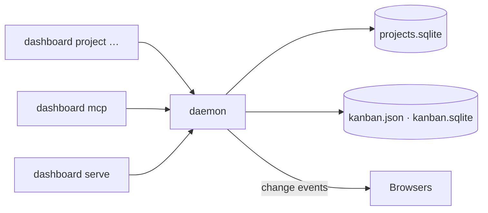

# Daemon

The daemon is the process that opens a home's databases. Nothing else does.

That is the whole idea, and everything below follows from it. The CLI, the web server and the
MCP server are interfaces; the daemon is where the data lives.



## Why one process

SQLite takes one writer. Two processes opening the same file hit `SQLITE_BUSY`, and the driver
retries forever while holding a thread — which surfaces as a hang, not an error, and looks
like an exhausted connection pool. Running `dashboard mcp` next to `dashboard serve` used to
be enough to trigger it.

The second reason is change events. Each process that opened the files had its own event
broadcaster, so a card created from an editor over MCP could never reach an open browser —
not because of a missing feature, but because the event had no path across the process
boundary. With one owner there is no boundary: every mutation, from any interface, fans out to
every subscriber.

## Lifecycle

**It starts itself.** The first command that finds no daemon starts one and waits for it to
answer. You do not normally run `daemon start`.

**It stays up.** Nothing times it out. A daemon that disappeared on its own would only be
started again by the next command, so the churn would buy nothing.

**An upgrade replaces it.** A command checks the build the daemon reports, not only that it
answers. A daemon started by an older binary is asked to let go and a fresh one takes the home,
so you never have to remember to stop it after `mise run backend:release`.

**You stop it.** Because it runs until told otherwise, stopping is an explicit command.

```bash
dashboard daemon status    # is one running for this home, and on what port
dashboard daemon start     # start it if it is not already up
dashboard daemon stop      # stop it; the next command starts a fresh one
dashboard daemon run       # run it in the foreground — what start spawns
```

`status` prints `{home, running, url}`, so it scripts:

```bash
dashboard daemon status | jq -e .running >/dev/null && echo up
```

Stop it when you want the home released: before deleting the folder, or when you would rather
it not linger. Swapping the binary needs nothing — the next command notices the change of build
and replaces the daemon itself.

## One daemon per home

The daemon binds a loopback port of its own and writes it, with its pid, to `daemon.port` in
the home:

```text
~/.config/kanban-harness/
├── config.yml
├── credentials.json
├── projects.sqlite
└── daemon.port        # "<port> <pid>"
```

The port is per home rather than fixed, so two homes never share a daemon and never collide.
A repository with its own `.kanban-harness/` therefore gets its own daemon, independent of
your user-level one — see [Home](cli#home) for how a home is chosen.

The daemon listens on `127.0.0.1` only. `--hostname 0.0.0.0` describes `dashboard serve`, the
thing a browser talks to — never the daemon.

## Handover

`dashboard serve` owns the home too — it has to, or it would be the second opener the whole
design exists to prevent. So when `serve` starts and a daemon is already running, it asks that
daemon to stop, waits for it to let go, and takes over. The reverse holds as well.

You do not have to sequence anything. Starting a server after having used the CLI just works,
and there is never a moment when two processes hold the databases.

## When something is wrong

**A command hangs for ten seconds, then says the daemon timed out.** Run
`dashboard daemon run` in the foreground; whatever is failing at startup (a corrupt registry, a
failed migration, a port it cannot bind) is printed there instead of being discarded.

**`process N still owns this home after being asked to stop`.** A previous owner ignored the
request. `kill -9 N`, delete `daemon.port`, and retry.

**An environment variable seems ignored.** The daemon does the work, and it inherited the
environment of whichever command started it — not the one you just typed. So
`MVP_DASHBOARD_CLAUDE_BIN=… dashboard ai ticket …` changes nothing if a daemon is already up.
Put the value in `config.yml`, which is read per request, or `dashboard daemon stop` first.

**Stale `daemon.port` after a crash.** Harmless. The next command notices nothing is listening,
removes it and starts a daemon.

## See also

- [CLI](cli) — the commands that use it
- [MCP](mcp) — the same daemon, over stdio
- [Server](server/overview) — the browser-facing interface
