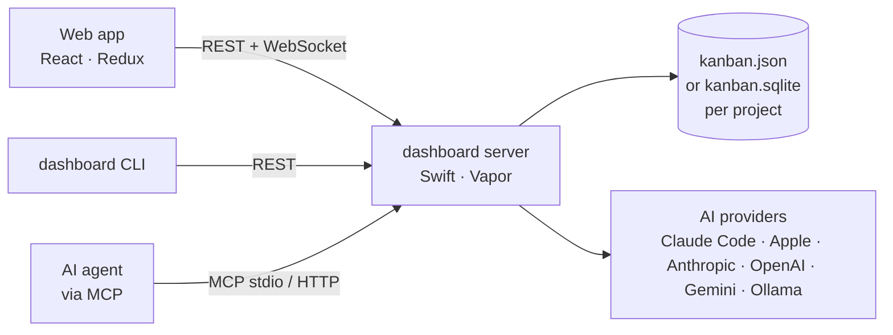

# MVP Dashboard

A personal kanban dashboard where an **AI drafts the tickets** and you stay in control of
the board. One Swift server is the source of truth; three clients drive it:

| Surface     | Who uses it                      | Doc                     |
| ----------- | -------------------------------- | ----------------------- |
| **Web app** | you, in a browser                | [Web app](web/features) |
| **CLI**     | you, in a terminal, and scripts  | [CLI](cli)              |
| **MCP**     | AI agents (Claude Code, Cursor…) | [MCP](mcp)              |

## What it does

- **Projects are folders** on your machine. Each holds one workspace — boards, columns, cards —
  as `kanban.json` (the [kanban-rs](https://github.com/kanban-rs/kanban) v18 format, so that
  CLI/TUI opens it too) or `kanban.sqlite`. Switch between the two any time, nothing is lost.
- **Boards** with columns, WIP limits, cards you drag between columns, **sub-tasks** that
  live in their own column and stay linked to their parent, markdown descriptions with
  clickable checklists.
- **Draft with AI**: describe a ticket in a sentence; the model writes title, description,
  acceptance criteria, priority, points — and splits it into sub-tasks when the work is too
  big for one card. You watch it type, see every step and what it cost, then press Create.
- **Live everywhere**: a change made from the CLI or by an AI agent shows up in every open
  browser without a reload.
- **Your cost**: every AI-drafted card remembers which provider wrote it and what it cost.
- **Providers are pluggable**: Claude Code (your Claude login, no API key), Apple's on-device
  model (free), Anthropic, OpenAI-compatible, Gemini, Ollama.

## Where to go next

- [Getting started](getting-started) — install, run, first project.
- [Architecture](architecture) — how the pieces fit, and why.
- [Conceptions](conceptions/ai-agents) — designs for what comes next (agents, MCP tools).
