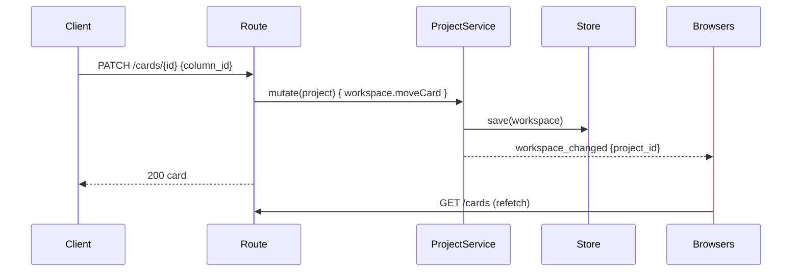

# Server

`dashboard serve` is one Swift process (Vapor 4) that owns the data and serves every client.

```bash
dashboard serve [--hostname 127.0.0.1] [--port 5175] [--static-dir dist] [--cors-origin URL ...] \
                [--public-url http://127.0.0.1:5173]
```

`--public-url` (or `MVP_DASHBOARD_PUBLIC_URL`) is the origin a browser reaches the dashboard
at — the Vite dev server in development, a reverse proxy or the machine's address under
`--hostname 0.0.0.0`. The OAuth redirect URI and the landing after a provider sign-in are both
built from it, so it has to be an origin that serves the app. Without it those come from the
request's `Host` header, which is trusted only when it is loopback.

| It serves          | Where                              |
| ------------------ | ---------------------------------- |
| the HTTP API       | `/api/…` — see [HTTP API](api)     |
| live change events | `GET /api/events` (WebSocket)      |
| the MCP endpoint   | `POST /mcp` — see [MCP](../mcp)    |
| the built web app  | `--static-dir dist` (SPA fallback) |

## What it owns

```text
$MVP_DASHBOARD_HOME/            (~/.config/kanban-harness by default)
  projects.sqlite               the registry: which folders are projects
  settings.json                 server settings, applied live
  config.yml | config.json      AI providers and pricing
  credentials.json              API keys and OAuth tokens
  daemon.port                   the running daemon's port and pid

<project folder>/
  kanban.json | kanban.sqlite   the workspace: boards, columns, cards, links
```

The registry only knows _where_ projects are; each project's data stays in its own folder,
in a file you can open with other tools (kanban-rs for JSON, any SQLite client for the
database).

## One mutation, one event

Every write goes through a service actor (`ProjectService.mutate`): load the workspace,
apply the domain operation, save through the project's store, broadcast a change event. The
web app, the CLI and MCP all end up in the same place, so they can never disagree about the
state of a board.



Events on the socket: `hello` (on connect), `projects_changed`, `workspace_changed`
(`project_id`), `settings_changed`, `ai_config_changed`. Clients map an event to the caches
it invalidates and refetch; the socket never carries data, so a lost event costs at most one
refetch.

## Errors

One envelope everywhere: `{"code": "...", "message": "..."}` with the HTTP status that fits.

| Code                | Status | When                                                         |
| ------------------- | ------ | ------------------------------------------------------------ |
| `VALIDATION_FAILED` | 400    | domain rule broken (empty title, WIP limit, relation cycle…) |
| `NOT_FOUND`         | 404    | project, board, column, card, provider                       |
| `ALREADY_EXISTS`    | 409    | duplicate project name or path                               |
| `AI_NOT_CONFIGURED` | 400    | no provider configured                                       |
| `AI_PROVIDER`       | 502    | the provider failed or is unreachable                        |
| `AI_BAD_OUTPUT`     | 502    | the model returned something that is not a valid draft       |
| `INTERNAL`          | 500    | anything else; the `X-Request-Id` header ties it to the log  |

Every response carries `X-Request-Id`.

## Running in production

`mise run serve` builds the web app and a release binary and serves both from one process
on port 5175, bound to loopback. To reach it from another machine use `serve:lan` or
`MVP_DASHBOARD_HOST=0.0.0.0` — and read [Security](security) first.
