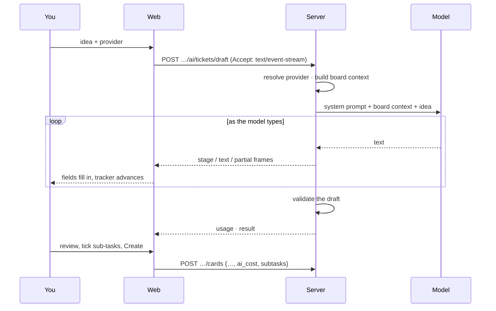

# Draft with AI

In the _New card_ dialog, **✨ Draft with AI** opens a small form: describe the ticket in a
sentence or two, pick a provider (when several are configured), press **Draft**.

## What you see while it works

The **activity panel** has three levels of detail:

1. **Tracker** — _Prepare · Wait for model · Streaming · Validate_, the current step pulsing,
   red on failure.
2. **Summary line** — `Claude Code · sonnet · 6.1 s (first token 2.3 s) · 2 in / 418 out ·
$0.028`. Cost reads `≈` when estimated from pricing, `free` for local models.
3. **Field checklist** — `✓ title ✓ description ✓ criteria 4 – points ✓ subtasks 3`: which
   parts of the draft have arrived.
4. **Details** — per-phase durations (how long you waited for the first token, how long the
   model streamed), the provider and board-context lines, any error with its code, **Copy log**
   for bug reports, and **Raw output** — the model's JSON as it was typed.

The title and description fill in **as the model types**; **Cancel** stops the request.

## What the model is asked for

A JSON object with `title`, `description` (markdown), `acceptance_criteria` (2–6 verifiable
statements), `priority`, optional `points`, and `subtasks` — an array the model is told to
leave **empty unless the work clearly needs several independent pieces** (more than a day,
several layers such as API + app + email, separate deliverables). The board context (columns,
recent card titles) is passed as data inside `<board>` delimiters and the system prompt says
it is never to be read as instructions.

## Review, then Create

Nothing is created until you press **Create**. The draft only fills the form:

- acceptance criteria land in the description as a markdown checklist;
- proposed **sub-tasks** appear as ticked, editable rows — untick what you don't want, add
  your own; the button reads _Create 1 + 3 cards_ and creates parent and children in one
  request (all or nothing);
- the card remembers the draft's **cost** (`ai_cost`: provider, model, tokens, USD, whether
  estimated).

## Providers

Any configured provider can draft. Apple's on-device model is free and needs no key (macOS
26); Claude Code uses your Claude login. See [Providers](../ai/providers) and
[Streaming and cost](../ai/streaming-and-cost).
